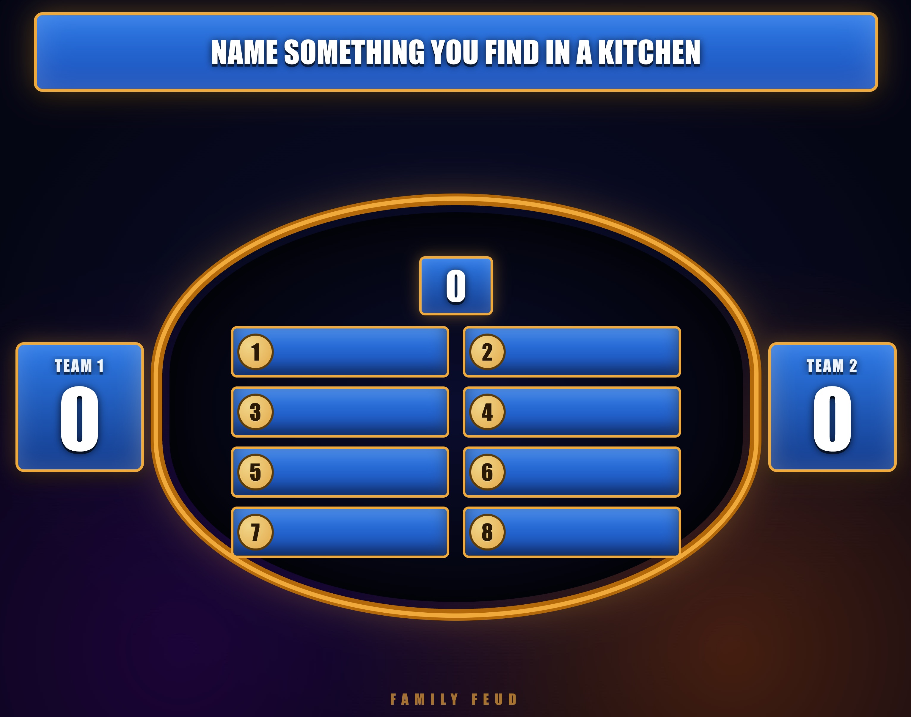
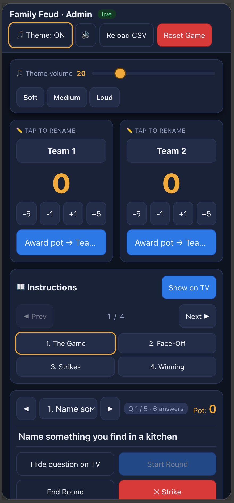

# Family Feud Live

Host a Family Feud-style game from your laptop and run it from your phone. Two screens, one Node/TypeScript process, WebSocket sync, SQLite so a crash mid-game doesn't lose anything.

- **Port 3000 — Audience display.** Big oval board, team scores, pot, strikes overlay, theme music, ding and buzzer sound effects. Open on the laptop you're projecting.
- **Port 4000 — Game master admin.** Reveal answers, mark strikes, award the pot, edit team names, jump between questions, mute or unmute. Built for a phone.

Both screens stay in sync over Socket.IO. If the server dies mid-round, restart it and you're back exactly where you were.

<table>
<tr>
<td valign="top" width="65%">
<b>Audience display</b> — project this on the big screen.<br><br>

</td>
<td valign="top" width="35%">
<b>Admin</b> — run this from your phone.<br><br>

</td>
</tr>
</table>

## Setup

```bash
cd familyfeud
npm install
npm run build
npm start
```

Then:

- Audience: <http://localhost:3000>  (project / share screen)
- Admin:    <http://localhost:4000>  (open on your phone)

For phone access on the same Wi-Fi, use `http://<your-mac-ip>:4000`. On macOS, `ipconfig getifaddr en0` gives you the IP. If you need to reach the admin from outside your LAN, point any tunnel of your choice at port 4000.

## Questions CSV

Drop a `questions.csv` in the project root. Format:

```csv
question,answer,points
Name something you find in a kitchen,Refrigerator,38
Name something you find in a kitchen,Stove,22
...
```

- Rows with the same `question` value are grouped into one round.
- Answers are sorted by points (highest on top), Family Feud style.
- Hit **Reload CSV** in the admin to pick up changes (resets game; team names kept).

## Game flow

1. Set team names in the admin (e.g. "The Smiths" / "The Joneses").
2. Pick a question from the dropdown.
3. **Start Round** — the question lights up on the audience screen, board hides answers.
4. As contestants answer, hit **Reveal** on the answer they said. Points add to the pot.
5. Wrong answer during a round? Hit **✕ Strike**. Three Xs flash on the audience screen and the buzzer plays.
6. Wrong answer during the face-off (where the first wrong answer doesn't count as a strike on the show)? Hit **🔊 Buzz** instead. Same sound, no strike counted.
7. **Award pot →** sends the round's pot to whichever team won.
8. **Next ▶** advances to the next question.

## Sound

The audience screen plays:

- 🎵 **Theme song** — drop an audio file at `audio/sfx/theme.m4a` and the server will serve it at `/theme.m4a` (looped). The Family Feud theme is copyrighted by its rightsholders and not bundled here — bring your own. (`.m4a`, `.mp3`, `.wav`, `.ogg` all work if you adjust the filename or the route in `src/server.ts`.)
- 🛎 **Reveal "ding"** — synthesized in-browser (Web Audio bell stack) every time you reveal an answer.
- 🔊 **Strike "EH-EH-EH" buzzer** — synthesized in-browser every time you click ✕ Strike.

Browsers block audio autoplay, so the audience screen shows a one-time **"Click anywhere to start"** gate — click or hit space/enter to enable sound.

The admin has two audio buttons:

- **🎵 Theme: ON/OFF** — toggle the theme music.
- **🔊 / 🔇 Muted** — global mute (silences everything, theme + sound effects).

Both are part of game state and persist across restart.

## Persistence

State is saved to `familyfeud.db` (SQLite, WAL mode) after every command. If the server crashes mid-game, restart it with `npm start` and you'll come back exactly where you were: same question, same revealed answers, same pot, strikes, scores, team names.

- `DB_PATH=/some/path npm start` to put the DB elsewhere.
- **Reload CSV** (admin) re-reads `questions.csv` and resets game state but keeps team names. The new state is then persisted.
- **Reset Game** (admin) clears scores/reveals but keeps team names. Also persisted.
- To wipe everything and start clean: stop the server, `rm familyfeud.db*`, restart.

## Dev

```bash
npm run dev   # tsc --watch + nodemon
```

## How this compares to other open-source Family Feud projects

There are a handful of Family Feud implementations on GitHub. Quick lay of the land:

| Project | Stars | Stack | Shape |
|---|---|---|---|
| [joshzcold/Friendly-Feud](https://github.com/joshzcold/Friendly-Feud) | ~135 | Next.js + Go, Docker | Hosted multi-room with join codes, separate `/admin` + `/buzzer`, Fast Money, i18n. The polished, full-featured option. |
| [MacEvelly/Family_Feud](https://github.com/MacEvelly/Family_Feud) | ~14 | Node + Express + Socket.io | Two-browser host/audience model. Closest architectural sibling to this. No persistence, no sound, no Fast Money. |
| [PierPlayss/Family-Feud](https://github.com/PierPlayss/Family-Feud) | ~10 | C++/SDL2 native | Argentinian variant, OBS-friendly. No web, no networking. |
| [tiwoc/clan-contest](https://github.com/tiwoc/clan-contest) | ~9 | Vanilla HTML5 | Pure browser, no server. Two-window control + projector via `postMessage`. Sound effects, GPL3. |
| [ChicagoBlend/Family-Feud](https://github.com/ChicagoBlend/Family-Feud) | ~5 | jQuery | Single-screen keyboard-driven. Optional WebSocket hook for **physical hardware buzzers** — its standout feature. |
| [ebron-tech/FamilyFeud](https://github.com/ebron-tech/FamilyFeud) | ~2 | Unity/C# | Two native binaries over OSC + buzzer hardware schematic. Heavy, in-person church events. |

### Where this project is different

- **Properly separated admin and display over WebSocket.** Only Friendly-Feud does this seriously, and that one needs Docker, Go, and room-code lobbies. This is `npm install && npm start` in a single Node process.
- **SQLite crash recovery.** None of the projects above persist live game state. They all start fresh on reload. This one survives a kernel panic mid-round.
- **Mobile-first admin on a dedicated port.** Friendly-Feud's admin is responsive but built desktop-first. The others assume the host is at a keyboard. Yours runs from a phone.
- **Synthesized Web Audio SFX (no asset shipping).** Most projects ship `.ogg` or `.mp3` files. The ding and buzzer here are math, not media. Cleaner repo, no licensing headaches.
- **Looks like the actual TV show.** Oval board, gold frame, animated tile flips, score pills. Most projects look utilitarian.

### What this project doesn't do

- **No multi-room or remote play.** Friendly-Feud's join-code system lets strangers play over the internet. This is LAN-only on purpose.
- **No Fast Money round.** Friendly-Feud has one, with timers.
- **No physical hardware-buzzer integration.** ChicagoBlend and ebron-tech both support this.
- **No i18n.** Friendly-Feud ships four languages.

If you want a hosted, feature-complete product, use Friendly-Feud. If you want something lightweight you can throw on your laptop in five minutes that looks like the show, use this.

## License

[MIT](./LICENSE) © Conrad Chu. Note: any media files you place under `audio/sfx/` are not covered by this license — they remain the property of their respective rightsholders.
